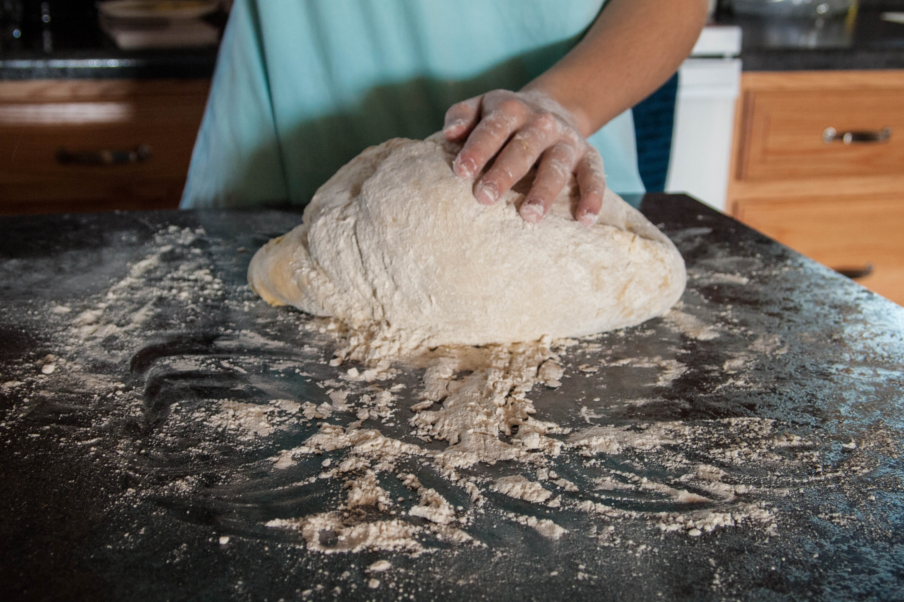

# React Native Dough

[](https://facebook.github.io/react-native/)
[](https://facebook.github.io/react-native/)
[](https://facebook.github.io/react-native/)
[](http://makeapullrequest.com)
[](LICENSE)

React Native HelloWorld app with linter configuration optimized for VSCode.

Malleable. Just like dough.



What’s in the box:

* React Native
* Flow
* ESLint
* Prettier

For Sublime Text install the corresponding packages listed iyn the [setup guide](docs/SETUP.md).

## Prerequisites

* [React Native](https://facebook.github.io/react-native/docs/getting-started.html)

## Install

1.  Clone project

```sh
$ git clone https://github.com/rodrigobdz/react-native-dough.git
```

2.  Install dependencies

```sh
$ cd react-native-dough
$ yarn install
```

## Usage

Run application

```sh
# iOS
$ react-native run-ios
# Android
$ react-native run-android
```

## Issues

If you encounter any problems, please create a [GitHub Issue](https://github.com/rodrigobdz/react-native-dough/issues).

## Credits

Image taken from [ABSFreePic](http://absfreepic.com/free-photos/download/a-woman-kneading-the-dough-4032x2688_54470.html).

## License

[MIT](LICENSE)

Copyright (c) 2018 Rodrigo Bermúdez Schettino.
